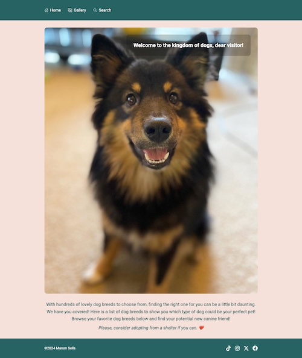
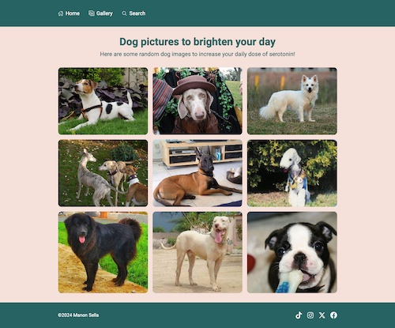
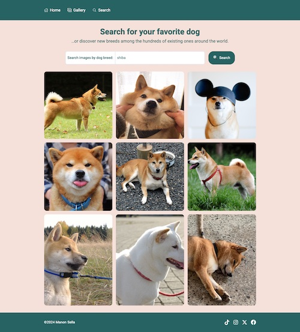

# My "All about dogs" Mini Website

This is a mini website created with React, React Router, Tailwind CSS, Vite, using the [Dog CEO API](https://dog.ceo/dog-api/).

**Objective:** Create a 3-page website.
The responsiveness and user-experience should be specifically taken into consideration.

## Getting started

1. **Clone the repository**
   Clone the repository to your local machine.
   ```sh
   git clone https://github.com/ManoSella/weInk.git
   ```
2. **Navigate the project directory**
   Change directory into the cloned repository:
   ```sh
   cd weInk
   ```
3. **Install dependencies**

   ```sh
   npm install
   ```

4. **Start the development server**
   ```sh
   npm run dev
   ```

## Screenshots




